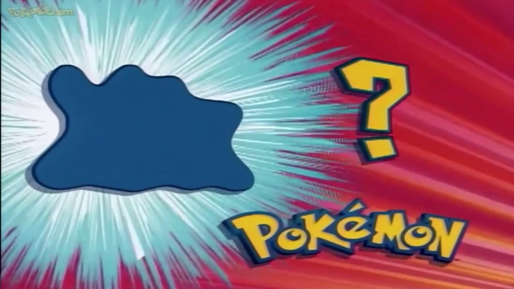

** Bem vindos ao Quiz de Pokemon! **

Fiz seguindo algumas instruções mas acabei por adaptar ao meu gosto!!

Deixo aqui meu código com algumas anotações para melhor entendimento do ques está rolando :)

<!DOCTYPE html>
<html lang="pt-br">
  
    <head>

        <meta charset="UTF-8">
        <meta name="viewport" content="width=device-width, initial-scale=1.0">
        <meta name="description" content="Quiz sobre pokemon para fãs!">
        <link rel="stylesheet" href="style.css">
        <title>Quiz de Pokemon</title>

    </head>

    <body>

        <header>

            <h1>Quiz interativo para jogadores de Pokemon</h1>
            
Teste seus conhecimentos sobre os Pokemons que você conhece e acumule pontos!

        </header>

        <main>

            <!--Intordução-->

            <section>

                <h2>Sobre o Quiz</h2>
                
 <strong> Este Quiz </strong> foi desenvolvido pensando nos fãs de <em> Pokemon </em>, para testar seus conhecimentos, desde nome dos Pokemons, até evoluções, por exemplo! 

                
Você encontrará diversos tipos diferentes e aleatórios de perguntas, multiplas escolhas, textos e muito mais.  Explore o que você sabe com este Quiz!

            
            </section>

            <!--Pergunta 1: múltipla escolha-->
            <section>

                <h2>Pergunta 1: Qual o primeiro pokemon de Ash?</h2>
                <form>

                    <input type="radio" value="Pikachu" id="p1a" name="Pergunta1">
                    <label for="p1a">Pikachu</label>  

                    <input type="radio" value="Charmander" id="p1b" name="Pergunta1">
                    <label for="p1b">Charmander</label>  

                    <input type="radio" value="Bulbasauro" id="p1c" name="Pergunta1">
                    <label for="p1c">Bulbasauro</label>  

                    <input type="radio" value="Squirtle" id="p1d" name="Pergunta1">
                    <label for="p1d">Squirtle</label>  

                </form>

            </section>

            <!--Pergunta 2: Texto-->
            <section>

                <h2>Pergunta 2: Os seguintes pokemons:Lapras, Piplup, Staryu e Magikarp. São pokemons do tipo _______.  </h2>
                <input type="text" id="p2" name="Pergunta2" placeholder="Digite sua resposta...">

            </section>

            <!--Pergunta 3: Senha-->
            <section>

                <h2>Pergunta 3: Escreva uma senha de acordo com seu Pokemon preferido.</h2>
                <form>

                    <input type="password" id="p3" name="Pergunta3" placeholder="Digite sua senha..."> 

                </form>

            </section>

            <!--Pergunta 4: Data-->
            <section>

                <h2>Pergunta 4: Em que ano o anime de Pokemon foi lançado? </h2>
                <form>
                    <input type="date" id="p4" name="Pergunta4">
                </form>

            </section>

            <!--Pergunta 5: Seleção Multipla-->
            <section>
                <h2>Pergunta 5: Quais são os 3 pokemons iniciais da primeira geração? </h2>
                <form>

                    <input type="checkbox" id="p5a" name="Pergunta5" value="Charmander">
                    <label for="p5a">Charmander</label>

                    <input type="checkbox" id="p5b" name="Pergunta5" value="Squirtle">
                    <label for="p5c">Squirtle</label>

                    <input type="checkbox" id="p5c" name="Pergunta5" value="Carterpie">
                    <label for="p5c">Caterpie</label>

                    <input type="checkbox" id="p5d" name="Pergunta5" value="Bulbasauro">
                    <label for="p5d">Bulbasauro</label>

                </form>
            </section>

            <!--Pergunta 6: Upload de arquivo-->
            <section>

                <h2>Pergunta 6: Faça o upload de uma imagem do seu pokemon de preferência.</h2>
                <form>
                    <input type="file" id="p6" name="Pergunta6">
                </form>

            </section>

            <!--Pergunta 7: Menu suspenso-->
            <section>

                <h2>Pergunta 7: Selecione a última evolução do Gastly</h2>
                <form>
                    <select name="Pergunta7" id="p7">
                    <option value="Charmilion">Charmilion</option>
                    <option value="Haunter">Haunter</option>
                    <option value="Gengar">Gengar</option>
                    </select>
                </form>

            </section>

            <!--Pergunta 8: Imagem-->
            

                <section >
                    <h2>Pergunta 8: Qual Pokemon é representado pela imagem abaixo? </h2>
                    <figure>

                          
                        <figcaption>Figura 1: Foto enigmática de um Pokemon.</figcaption>
                    </figure>
                    <input type="text" id="p8" name="Pergunta8" placeholder="Digite sua resposta..">
                </section>
            

            <!--Tabela de Pontuação-->
            <section>
                <h2>Tabela de Pontuação</h2>
                
                <table border="1">

                    <thead>
                        <tr>
                            <th>Pontuação</th>
                            <th>Avaliação</th>
                        </tr>
                    </thead>
                    <tbody>

                        <tr>
                            <td>0-2</td>
                            <td>Não desista. Você ainda pode se tornar um treinador Pokemon!</td> 
                        </tr>

                        <tr>
                            <td>2-4</td>
                            <td>Continue tentando. Você ainda pode se tornar um treinador Pokemon!</td> 
                        </tr>

                        <tr>
                            <td>4-6</td>
                            <td>Uau, supreendente. Você está a poucos passos de se tornar um grande treinador Pokemon!</td> 
                        </tr>

                        <tr>
                            <td>6-8</td>
                            <td>Incrível. Você realmente sabe tudo!</td> 
                        </tr>
                    </tbody>
                    <tfoot>
                        <tr>
                            <td colspan="2">Boa sorte na próxima!</td>
                        </tr>
                    </tfoot>

                </table>
            </section>

            <!--Lista de Respostas-->
            <section>
                <h2>Verifique suas respostas</h2>
                

                    
Clique aqui para verificar as respostas do Quiz!

                    <ol>
                        <li>Pikatchu</li>
                        <li>Água</li>
                        <li>ex: Ash123</li>
                        <li>01/04/1997</li>
                        <li>Charmander,Squirtle e Bulbasauro</li>
                        <li>A imagem tem que ser de algum POkemon</li>
                        <li>Gengar</li>
                        <li>Ditto</li>
                    </ol>
                

            </section>

            <!--Formulário de Feedback-->
            <section>
                <h2>Nos dê o seu feedback</h2>
                <form>
                    <fieldset>

                        <legend>Informações de contato</legend>

                        <label for="name">Nome: </label>
                        <input type="text" id="name" name="name"> 

                        <label for="email">Email: </label>
                        <input type="email" id="email" name="email"> 
                        
                        <label for="comentario">Comentário: </label> 
                        <textarea id="comentarios" name="comentarios" rows="4" cols="50" placeholder="Digite seu comentário">

                        </textarea>
                    </fieldset>

                </form>
            </section>

        </main>

        <footer>

            
&copy Quiz de Pokemon. Todos os direitos reservados.

            
Para conhecer a autora,<a href="https://www.instagram.com/ibarbaram_/?hl=pt-br" target="_blank"> clique aqui! </a> 

        </footer>

    
    
    </body>
</html>
